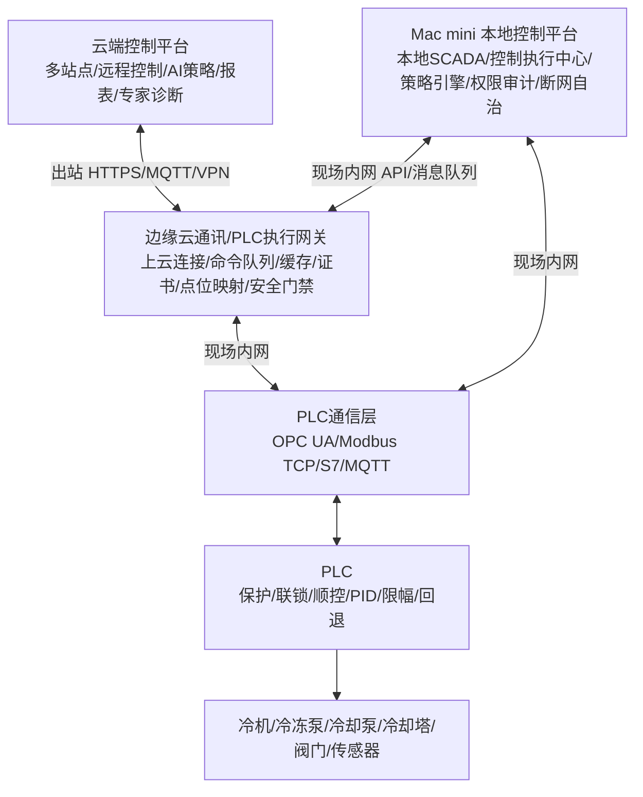

# 云端-本地-网关-PLC控制架构 V1

## 1. 结论

新系统要取代旧系统，但不能损失旧系统已有云端控制能力。最终架构应采用：

```text
云端控制平台
  -> 边缘云通讯/PLC执行网关
  -> Mac mini 本地控制平台
  -> PLC网关/PLC通信层
  -> PLC
  -> 现场设备
```

其中本地控制平台不直接上外网。云端逻辑上可以连接现场，但物理链路由边缘云通讯/PLC执行网关承担。

## 2. 设计原则

| 原则 | 要求 |
| --- | --- |
| 不退化 | 旧系统已有云端控制、设定值修改、模式切换、执行回执能力必须保留并增强。 |
| 本地自治 | Mac mini 本地控制平台在无公网时仍可完成本地 SCADA、控制、告警、报表和审计。 |
| 云控可用 | 云端平台可以远程控制，但不直接写 PLC 底层寄存器。 |
| 网关隔离 | 上外网的是边缘云通讯/PLC执行网关，不是本地控制平台和 PLC。 |
| PLC兜底 | PLC 保留保护、联锁、顺控、PID、限幅、防震荡、通信失败回退。 |
| 统一执行 | 云端、本地、AI、人工命令都进入同一套命令队列、仲裁、审计和回执链路。 |

## 3. 推荐物理架构



说明：

1. `EdgeGw` 可以是独立工业网关，也可以是 PLC 网关上增加云通讯和命令队列能力。
2. `Local` 不配置公网默认路由，不访问云端域名，只访问现场内网地址。
3. `Cloud` 不能主动穿透进入 OT 网，建议由 `EdgeGw` 主动出站连接云端。
4. `Local` 是现场控制业务主控；`EdgeGw` 是通信和安全执行代理。

## 4. 网络分区

| 网络区 | 设备 | 是否可上外网 | 说明 |
| --- | --- | --- | --- |
| 云端区 | 云平台、对象存储、模型服务、报表服务 | 是 | 多站点管理和远程入口。 |
| DMZ/边缘区 | 边缘云通讯/PLC执行网关 | 是，且只允许出站 | 负责连接云端、缓存命令、同步数据。 |
| 本地平台区 | Mac mini 本地控制平台 | 否 | 本地 SCADA、控制执行、审计、报表。 |
| OT 控制区 | PLC网关、PLC、现场设备 | 否 | 控制网络，不直接暴露到云端。 |

防火墙建议：

| 方向 | 建议 |
| --- | --- |
| EdgeGw -> Cloud | 允许，限定域名/IP/端口，TLS 双向认证。 |
| Cloud -> EdgeGw | 默认禁止公网入站；如用 VPN/专线必须白名单和证书。 |
| Local -> Cloud | 禁止。 |
| Local -> EdgeGw | 允许，仅现场内网端口。 |
| EdgeGw -> PLC | 允许，但必须通过点位白名单和命令队列。 |
| Cloud -> PLC | 禁止。 |

## 5. 组件职责

| 组件 | 主要职责 | 不应承担 |
| --- | --- | --- |
| 云端控制平台 | 多站点总览、远程控制入口、AI策略、模型训练、策略包管理、报表、专家诊断、集团级审计。 | 直接写 PLC 寄存器、秒级控制闭环。 |
| 边缘云通讯/PLC执行网关 | 上云连接、命令队列、数据缓存、点位映射、证书、命令签名校验、TTL、防重复执行、回执上传。 | 绕过本地平台和 PLC 保护做任意写点。 |
| Mac mini 本地控制平台 | 本地 SCADA、操作员权限、本地审批、控制执行中心、策略引擎、告警、报表、审计、断网自治。 | 直接暴露公网、替代 PLC 做保护联锁。 |
| PLC通信层 | 协议转换、批量采集、点位读写、通信质量监测。 | 决定高级节能策略。 |
| PLC | 保护、联锁、基础顺控、PID、限幅、死区、最小启停、通信失败回退。 | 历史分析、AI训练、复杂经济优化。 |

## 6. 控制方式

云端不直接写 PLC 地址，而是发语义控制命令：

```json
{
  "commandId": "cmd-20260609-001",
  "siteId": "b25",
  "source": "cloud_manual",
  "commandType": "set_target",
  "target": "cooling_water_supply_temp_sp",
  "value": 28.5,
  "unit": "C",
  "ttlSeconds": 300,
  "operatorId": "admin",
  "reason": "降低冷却塔风机能耗，同时保持冷机COP不劣化",
  "rollbackValue": 30.0
}
```

网关和本地平台把语义命令翻译成现场点位：

| 语义目标 | PLC目标点 | 单位 | 下限 | 上限 | 执行方式 |
| --- | --- | --- | ---: | ---: | --- |
| `cooling_water_supply_temp_sp` | `AI_Tcws_Target` | C | 18 | 35 | 写目标寄存器，PLC斜率执行 |
| `chilled_water_supply_temp_sp` | `AI_Tchw_Target` | C | 5 | 12 | 写目标寄存器，PLC限幅执行 |
| `pump_dp_sp` | `AI_PumpDp_Target` | kPa | 80 | 280 | 写目标寄存器，本地PID执行 |
| `tower_auto_enable` | `AI_Tower_Mode` | bool | 0 | 1 | 模式请求，PLC确认后切换 |

## 7. 控制链路

### 7.1 云端远程控制

```text
云端发语义命令
  -> EdgeGw 接收并写入命令队列
  -> Local 从 EdgeGw 拉取待处理命令
  -> Local 做权限、工况、告警、点位、上下限、手自动状态校验
  -> Local 生成现场执行计划
  -> EdgeGw/PLC通信层写 PLC 目标寄存器
  -> PLC 做二次保护、限幅、防震荡、顺控
  -> EdgeGw 获取 PLC ACK/REJECT 和设备反馈
  -> Local 与 Cloud 同步审计和回执
```

### 7.2 本地人工控制

```text
本地操作员在 Mac mini 平台下发命令
  -> Local 进入同一套控制执行中心
  -> EdgeGw/PLC通信层执行
  -> PLC确认
  -> Local 本地审计
  -> EdgeGw 有云连接时同步云端
```

### 7.3 AI优化控制

```text
云端或本地AI生成目标值/策略包
  -> Local 校验数据质量、告警、设备边界、权限模式
  -> shadow/assisted/enforced 分级执行
  -> PLC执行或拒绝
  -> 持续评估COP、功率、温度稳定性和回退条件
```

## 8. 控制模式

| 模式 | 说明 | 是否写 PLC |
| --- | --- | --- |
| `off` | 只展示建议，不进入执行。 | 否 |
| `shadow` | 生成拟执行命令和回执，记录但不写 PLC。 | 否 |
| `assisted` | 人工审批后写目标寄存器，PLC可拒绝。 | 是 |
| `enforced` | 门禁满足后自动执行，失败阻断并回退。 | 是 |
| `local_fallback` | 云端不可达时，本地平台和 PLC 独立运行。 | 是 |

## 9. 仲裁优先级

| 优先级 | 来源 | 处理原则 |
| ---: | --- | --- |
| 1 | PLC急停、保护、联锁 | 最高优先级，任何云端/本地命令都不能覆盖。 |
| 2 | 现场手动、检修、挂牌 | 禁止远程和AI控制。 |
| 3 | 本地控制平台人工操作 | 优先于云端远程命令。 |
| 4 | 云端人工远程操作 | 需进入本地控制平台或网关队列审批校验。 |
| 5 | 本地AI优化 | 可在本地自治时运行。 |
| 6 | 云端AI策略 | 只下发策略包或目标值建议，受本地门禁约束。 |

## 10. PLC握手点建议

| PLC变量 | 类型 | 说明 |
| --- | --- | --- |
| `AI_ENABLE` | bool | 是否允许上级优化控制。 |
| `AI_HEARTBEAT` | int/string | 网关心跳。 |
| `AI_CMD_ID` | string/int | 当前命令编号。 |
| `AI_TARGET_CODE` | int | 目标类型编码。 |
| `AI_TARGET_VALUE` | real | 目标值。 |
| `AI_APPLY_REQ` | bool | 申请执行。 |
| `AI_ACK` | bool | PLC确认接收。 |
| `AI_REJECT` | bool | PLC拒绝。 |
| `AI_REJECT_REASON` | int | 拒绝原因编码。 |
| `AI_ACTIVE_VALUE` | real | 当前生效目标。 |
| `AI_ROLLBACK_REQ` | bool | 回退请求。 |

PLC伪代码：

```text
IF EmergencyAlarm OR SafetyTrip THEN
  Reject("safety_trip")
  UseLocalSafeControl()
END_IF

IF LocalManualMode OR MaintenanceMode THEN
  Reject("local_manual_or_maintenance")
  UseLocalControl()
END_IF

IF HeartbeatTimeout > 60s THEN
  FreezeLastSafeSetpoint()
  UseLocalAuto()
END_IF

IF NewAiCommand THEN
  IF TargetValue < MinLimit OR TargetValue > MaxLimit THEN
    Reject("target_out_of_range")
  ELSE
    Target := Clamp(TargetValue, MinLimit, MaxLimit)
    Target := RampLimit(Target, LastTarget, MaxDeltaPerCycle)
    IF Abs(Target - CurrentSetpoint) < Deadband THEN
      Hold()
      Ack(CommandId)
    ELSE
      ApplyTargetToLocalPid(Target)
      Ack(CommandId)
    END_IF
  END_IF
END_IF
```

## 11. 旧系统云控能力接管清单

用于保证新系统取代旧系统时不退化。

| 分类 | 字段 | 说明 |
| --- | --- | --- |
| 控制对象 | `deviceType` | 冷机、冷冻泵、冷却泵、冷却塔、阀门、模式。 |
| 控制对象 | `deviceId/deviceName` | 旧系统设备 ID 和名称。 |
| 控制动作 | `actionType` | 启停、频率、设定值、模式切换、复位、联动。 |
| 旧接口 | `legacyEndpoint` | URL、方法、参数、鉴权方式。 |
| 旧接口 | `requestPayload` | 旧系统实际请求示例。 |
| 旧接口 | `responsePayload` | 成功、失败、超时返回示例。 |
| 点位映射 | `semanticTarget` | 新系统语义目标名。 |
| 点位映射 | `plcAddress/tagName` | PLC点位或旧系统 tagName。 |
| 点位映射 | `unit/min/max` | 单位、上下限、精度。 |
| 权限 | `requiredRole` | 操作所需角色。 |
| 确认 | `confirmLevel` | 无确认、二次确认、审批、双人确认。 |
| 回执 | `ackMeaning` | HTTP成功、网关写入成功、PLC ACK、设备状态达到目标的区分。 |
| 回退 | `rollbackPolicy` | 固定值、最近稳定值、本地自动、人工回退。 |
| 风险 | `riskLevel` | 高、中、低。 |
| 验证 | `verifiedAt/verifiedBy` | 最近现场确认时间和责任人。 |

最小模板：

| 控制对象 | 动作 | 旧接口 | 新语义目标 | PLC/Tag | 单位 | 下限 | 上限 | 回执口径 | 回退策略 | 状态 |
| --- | --- | --- | --- | --- | --- | ---: | ---: | --- | --- | --- |
| 冷却塔 | 目标出水温 | TODO | `cooling_water_supply_temp_sp` | TODO | C | 18 | 35 | PLC ACK + 实际温度趋势 | 最近稳定值 | 待盘点 |
| 冷冻泵 | 压差目标 | TODO | `pump_dp_sp` | TODO | kPa | 80 | 280 | PLC ACK + 频率变化 | 本地自动 | 待盘点 |
| 冷机 | 运行台数建议 | TODO | `desired_chiller_count` | TODO | 台 | 1 | N | PLC顺控完成 | 本地台数控制 | 待盘点 |

## 12. 第一条 PoC 建议

优先做冷却塔 Approach / 冷却水出水温目标值闭环。

| 项目 | 建议 |
| --- | --- |
| 控制目标 | 在不触发冷机边界和温度震荡的前提下，降低 `P_chiller + P_tower_fan + P_cooling_pump`。 |
| 输入变量 | 湿球温度、冷却水供回水温、冷机负荷率、塔风机频率、冷机COP、告警、手自动状态。 |
| 输出控制量 | `targetApproachC` 或 `targetTcwsC`。 |
| 控制周期 | 5 到 10 分钟。 |
| 防震荡 | 死区 0.3 到 0.5 C，单次变化 0.2 到 0.5 C，加减塔延时 10 到 20 分钟。 |
| 保护 | 冷凝器最低进水温、塔风机最低频率、水泵最小流量、告警闭锁、通信超时回退。 |
| 模式 | 先 `shadow`，再 `assisted`，最后评估 `enforced`。 |
| 验收 | 命令可追溯、PLC可拒绝、回执可解释、断网可自治、COP不劣化。 |

## 13. 数据表建议

| 表 | 作用 |
| --- | --- |
| `sites` | 站点基础信息和部署模式。 |
| `devices` | 设备台账。 |
| `point_mappings` | 语义点位到 PLC/旧系统点位映射。 |
| `control_commands` | 云端/本地/AI命令主表。 |
| `control_command_events` | 命令生命周期事件。 |
| `control_receipts` | 网关、PLC、设备状态回执。 |
| `strategy_packages` | 策略包和模型版本。 |
| `audit_logs` | 权限、审批、回退、配置变更审计。 |
| `timeseries_points` | 运行时序数据。 |

## 14. API建议

| API | 作用 |
| --- | --- |
| `POST /api/sites/{siteId}/commands` | 云端或本地下发语义命令。 |
| `GET /api/sites/{siteId}/commands/pending` | 本地平台或网关拉取待执行命令。 |
| `POST /api/sites/{siteId}/commands/{commandId}/approve` | 本地/云端审批。 |
| `POST /api/sites/{siteId}/commands/{commandId}/dispatch` | 执行命令。 |
| `POST /api/sites/{siteId}/commands/{commandId}/rollback` | 回退命令。 |
| `POST /api/sites/{siteId}/commands/{commandId}/receipts` | 写入网关/PLC/设备回执。 |
| `GET /api/sites/{siteId}/point-mappings` | 查看点位映射。 |
| `PUT /api/sites/{siteId}/point-mappings/{target}` | 更新语义点位映射。 |

## 15. 硬件建议

| 角色 | 建议硬件 |
| --- | --- |
| Mac mini 本地平台 | M系列 Mac mini，UPS，固定IP，禁止休眠，Docker/PostgreSQL/Redis/Python/Node。 |
| 边缘云通讯/PLC执行网关 | 工业网关，双网口，4G/5G可选，4核CPU，4-8GB内存，eMMC/SSD，支持 Docker 更好。 |
| PLC通信层 | 支持现场协议的网关或工业通信模块。 |
| PLC | 保留现有为主，增加 AI/云控目标寄存器和保护逻辑。 |

Mac mini 适合做本地平台，不建议直接承担 PLC 协议驱动、硬实时控制和现场IO。

## 16. 实施顺序

1. 盘点旧系统云控能力，填完整接管清单。
2. 选定边缘网关形态：独立云通讯网关，或 PLC 网关增强为边缘执行网关。
3. 定义语义命令模型、点位映射模型、回执模型。
4. 在 Mac mini 本地平台实现控制执行中心最小闭环。
5. 接入第一条 PoC：冷却塔 Approach / 冷却水出水温目标值。
6. 先跑 `shadow`，确认命令生成、点位映射、回执和审计。
7. 再跑 `assisted`，人工审批后写 PLC 目标寄存器。
8. 满足一个月稳定运行数据后，再评估 `enforced`。

## 17. 当前需要甲方/现场确认的问题

| 问题 | 影响 |
| --- | --- |
| 旧系统云控接口清单是否完整可导出 | 决定接管范围。 |
| 现场是否允许边缘网关出站访问云端 | 决定云连接方案。 |
| 本地平台是否必须完全无默认网关 | 决定网络分区和部署方式。 |
| PLC是否能新增目标寄存器和ACK/REJECT变量 | 决定是否能做标准握手。 |
| 旧系统控制成功的回执语义是什么 | 决定新系统验收口径。 |
| 冷却塔/冷机厂家最低边界参数是否可拿到 | 决定AI优化安全边界。 |

