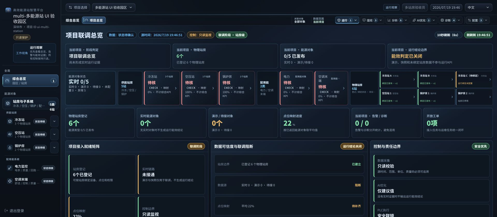
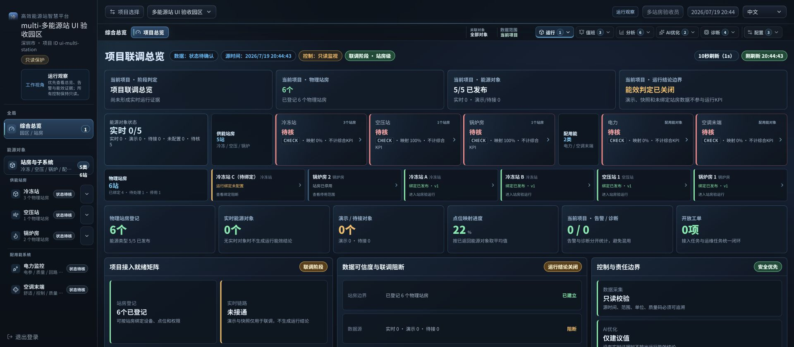
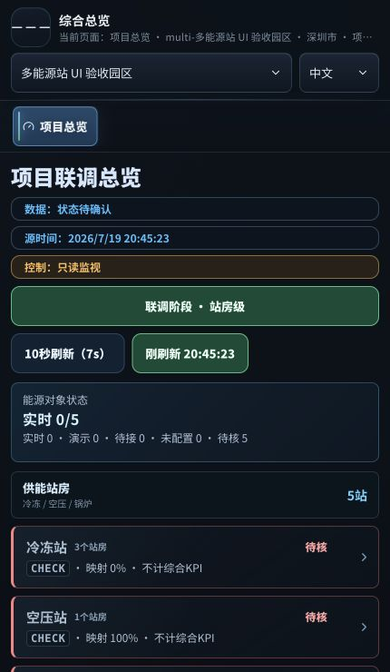
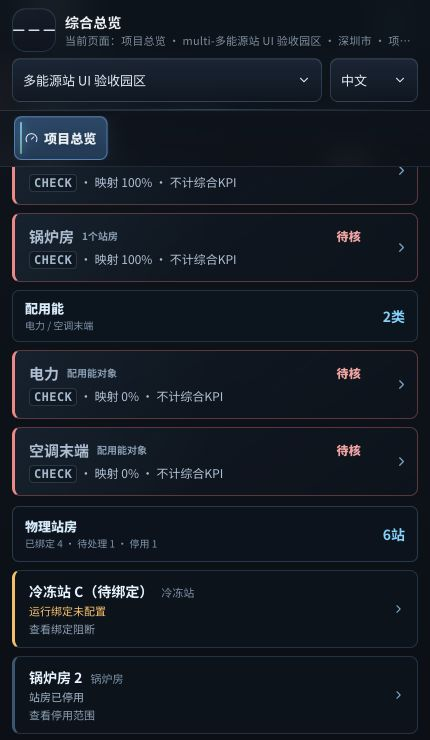
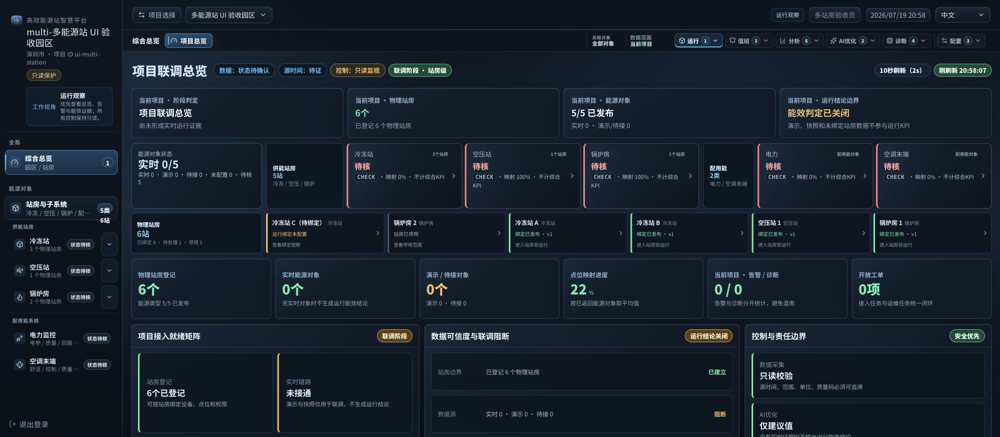
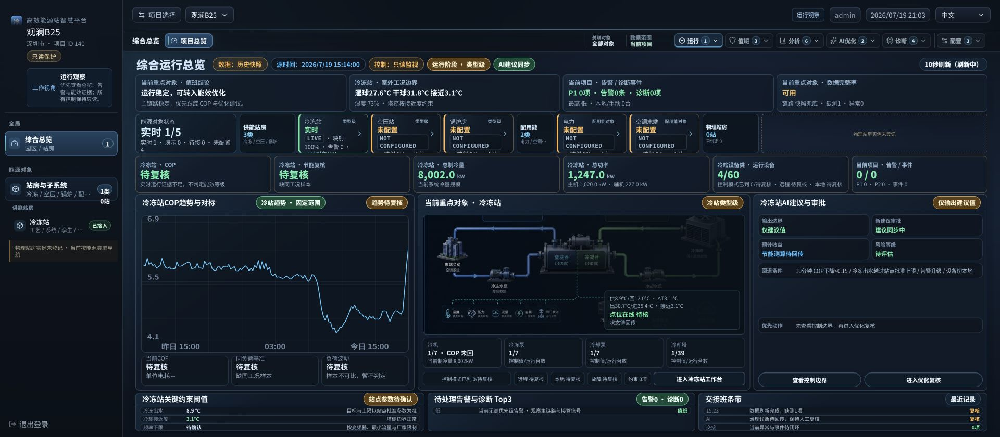
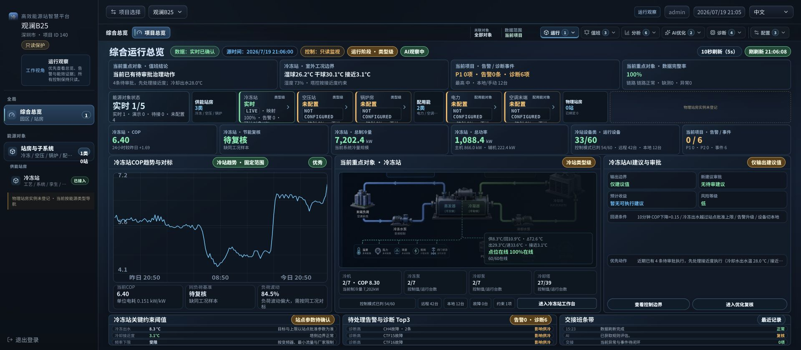
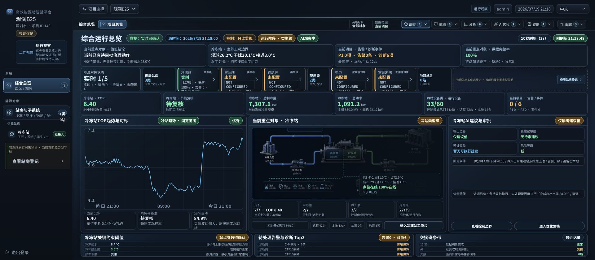
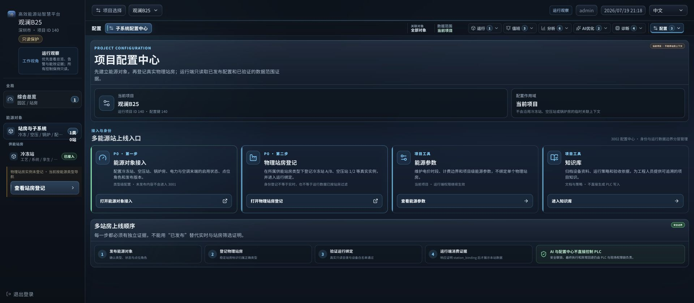

# 多能源站总览页运营结构审计

日期：2026-07-19

页面：`/dashboard?siteId=ui-multi-station`

模式：项目联调总览

证据：真实 Chrome，桌面 1920×840、移动 430×740，多站房只读夹具，以及固定入口 `http://127.0.0.1:3001/dashboard?siteId=140`

## 1. 审计范围与用户目标

本轮检查总览首屏是否能同时服务甲方管理者和工程值班人员：先识别项目阶段、数据可信度和需要处理的站房，再进入冷冻站、空压站或锅炉房核验运行证据。控制边界保持只读，未把绑定发布、演示或待核数据写成 LIVE。

## 2. 总体结论

本轮发现并修复六个结构性问题：物理站房被压在能源对象同一行导致卡片过小；待绑定和停用站房没有优先呈现；能力已发布数量错误地受运行状态影响，页面出现“五类对象均已登记但显示 0/5 已发布”的矛盾；联调页曾把 BFF `generatedAt` 聚合时间显示为“源时间”，容易被误认成 PLC 或网关采样时间；真实 3001 页面曾在 Top3 存在三条“诊断高”时仍显示项目“最高 中”，低报综合风险；真实项目 140 在物理站房为 0 时只有被动提示，没有明确登记入口。

修正后，能源类型与物理站房分成上下两层；站房按“待处理 → 停用 → 已绑定”排列，标题显示“已绑定 4 · 待处理 1 · 停用 1”；五类能力对象显示“5/5 已发布”，运行状态仍保持“实时 0/5、待核 5”。顶部“源时间”只消费 overview/trends 的 `freshness.latestTimestamp`；没有现场时间证据时显示“源时间：待证”，接口刷新时间继续通过独立刷新控件表达。项目最高风险同时消费告警和诊断严重度，真实入口现在将 `critical/major/high` 诊断正确汇总为“最高 高”，告警条数和诊断项数仍分列。物理站房为 0 时，左栏和总览都提供“查看站房登记”，只进入当前项目配置中心，不自动建站、不生成绑定、不触碰 PLC。

## 3. 流程步骤与健康状态

| 步骤 | 检查内容 | 健康状态 | 结论 |
| --- | --- | --- | --- |
| 1 | 桌面总览修正前 | 需改进 | 物理站房卡片被压缩；待绑定冷冻站位于正常站房之后；能力发布数显示 0/5，与已返回五类能力矛盾。 |
| 2 | 桌面总览修正后 | 健康 | 能源类型与物理站房分层，待绑定与停用实例前置，能力发布数与运行待核状态分开。 |
| 3 | 430px 移动首屏 | 健康 | 标题、数据状态、刷新信息和能源对象保持单列，无横向溢出。 |
| 4 | 移动物理站房矩阵 | 健康 | 一站一卡，先显示冷冻站 C 待绑定和锅炉房 2 停用，再显示已发布绑定站房。 |
| 5 | 异常站房下钻 | 健康 | 冷冻站 C 链接保留 `siteId + station + stationId`，进入“站房运行绑定尚未发布”阻断页，不回退项目级数据。 |
| 6 | 源时间证据边界 | 健康 | 无现场时间戳时显示“源时间：待证”；BFF 聚合时间仅作为刷新时间，不再冒充 PLC/网关采样时间。 |
| 7 | 真实 3001 固定入口 | 健康 | 当前 nginx 根目录为新壳 `dist`，BFF 8787 只读健康，真实项目 140 可加载最新总览。 |
| 8 | 告警 / 诊断最高风险一致性 | 健康 | Top3 三条高严重度诊断时，项目摘要由“最高 中”修正为“最高 高”；告警仍为 0 条、诊断仍为 6 项。 |
| 9 | 物理站房为零的下一步 | 健康 | 左栏与总览同时显示“查看站房登记”；两条链接均为 `/config-center?siteId=140`，不携带 `station/stationId`，配置中心可达“物理站房登记”模块。 |

## 4. 截图证据

### 步骤 1：修正前

### 步骤 2：桌面修正后

### 步骤 3：移动首屏

### 步骤 4：移动站房异常优先

### 步骤 5：待绑定站房阻断

### 步骤 6：源时间语义修正

修正前把页面聚合时间显示成“源时间”：

修正后在无权威遥测时间戳时明确显示“源时间：待证”：

### 步骤 7：真实 3001 固定入口

### 步骤 8：最高风险一致性修正

修正前，项目摘要“最高 中”与 Top3 的“诊断高”矛盾：

修正后，项目摘要同步显示“最高 高”：

### 步骤 9：物理站房为零的安全登记入口

真实项目 140 的左栏与总览同时提供当前项目登记入口：

进入后停留在当前项目配置作用域，并明确展示“物理站房登记”和上线证据顺序：

## 5. 已确认的产品改进

- 物理站房在联调/接入阶段获得独立全宽行，桌面宽屏六站一行，721–1320px 三站一行，430px 一站一卡。
- 站房排序以处理优先级为第一关键字，不再只按登记顺序或名称排列。
- 站房动作按状态显示“查看绑定阻断 / 查看停用范围 / 进入站房验运行”。
- `CHECK/unknown` 单独计入“待核”，不再进入“异常”计数。
- 能源能力发布数量直接来自能力清单，不再因运行证据待核而错误归零。
- BFF 页面聚合时间与现场源时间分开；只有 freshness 合同中的数据时间能进入“源时间”徽标。
- 项目最高风险从告警汇总和诊断队列共同计算；高严重度诊断不能因告警条数为 0 而被降级。
- 物理站房为零时不再停留在被动提示：左栏与总览均提供当前项目登记入口，能力证据未返回时仍失败关闭、不显示该动作。
- 登记入口只进入 `/config-center?siteId=<currentSiteId>`，不继承站房上下文，也不自动创建物理站房、设备/点位绑定或 PLC 控制关系。

## 6. 可访问性与证据限制

- 桌面文档宽度与视口均为 1920px；移动文档宽度与视口均为 430px，无横向溢出。
- 六张移动站房卡片宽度均为 406px，关键状态和动作没有被省略。
- 页面保留唯一语义主标题，站房卡片为可访问链接；本轮未宣称 VoiceOver、NVDA 或完整 WCAG 人工认证。
- 本地夹具只证明 UI、作用域和失败关闭行为，不证明现场 PLC、网关、源时间戳或实时 KPI 已接通。

## 7. 验证结果

- Chrome 控制台错误：0。
- 桌面站房顺序：`chilled-c → boiler-02 → chilled-a → chilled-b → air-01 → boiler-01`。
- 桌面/移动均显示：`5/5 已发布`、`待核 5`、`已绑定 4 · 待处理 1 · 停用 1`。
- 无现场时间证据时，DOM 返回 `data-operational-source-time=unverified`，页面显示“源时间：待证”。
- 真实 3001 刷新后，DOM 返回 `data-project-highest-risk=高`、`data-project-diagnostic-highest-rank=0`；同屏保持“告警0条 · 诊断6项”。
- 真实项目 140 返回 `data-dashboard-capability-state=loaded`、`data-physical-station-matrix-state=empty`；左栏和总览登记入口均为 `/config-center?siteId=140`。
- 点击总览入口后的真实 URL 为 `http://127.0.0.1:3001/config-center?siteId=140`，`station=false`、`stationId=false`；页面存在“物理站房登记”模块及 `http://127.0.0.1:3002/sites/140/stations` 管理入口。
- 真实 3001 页面 `window.__chillerBootErrors=[]`，文档宽度与视口均为 1920px。
- `npm run check` 与 `npm run build` 通过。
