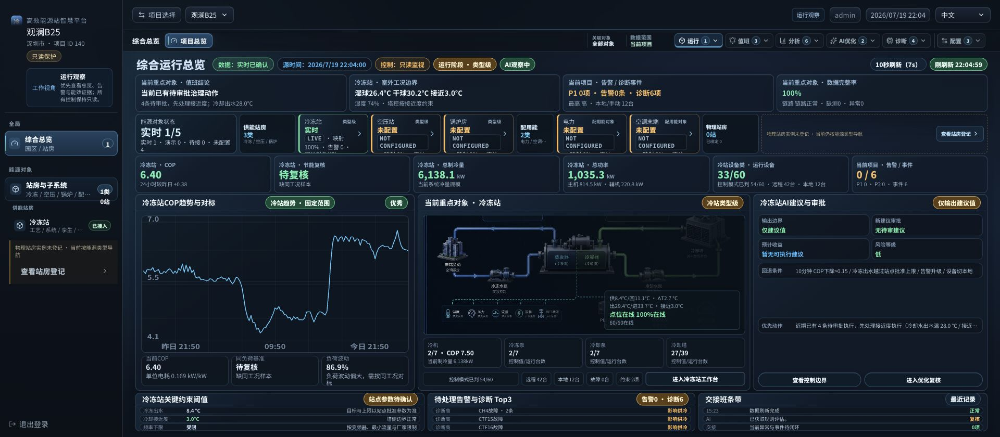
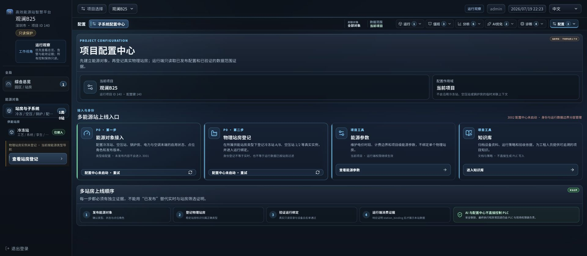
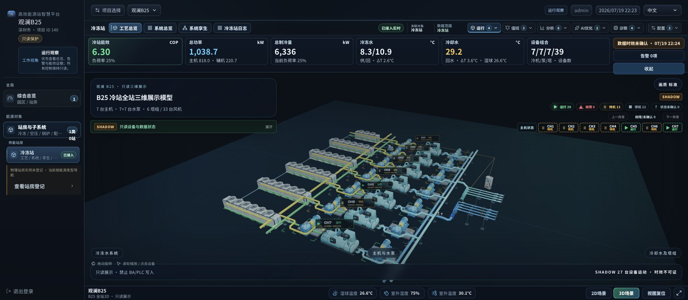

# 多能源站系统 UI 完成度审计

- 审计日期：2026-07-19
- 运行入口：`http://127.0.0.1:3001/dashboard?siteId=140`
- 当前项目：观澜 B25，项目 ID 140
- 审计方式：当前代码、构建/契约测试、真实 Chrome DOM 与 1920×840 视觉检查
- 结论：本轮多能源站 UI 结构改造已完成；现场数据侧仍需登记物理站房并发布运行绑定。

## 总体结论

当前信息架构已经形成清晰的两层模型：

1. 左侧承载“对象身份与站房切换”：综合总览、供能站房、配用能对象、物理站房实例。
2. 右上承载“当前对象的工作方式”：运行、值班、分析、AI 优化、诊断、配置。
3. 配置中心明确为项目级作用域，不继承冷冻站、空压站或锅炉房的临时关联上下文。
4. 总览页同时表达五类能源对象与物理站房登记状态；未配置对象不展示伪 KPI、不参与综合统计。
5. 当前项目只有冷冻站类型级实时证据，没有物理站房实例。UI 已如实显示 `0站`，没有虚构冷冻站 A/B、空压站 1/2 等实体。

因此，“冷冻站、空压站、锅炉房放左侧；值班、分析、AI、诊断、配置放右上”是合理且已落地的结构。它符合工业系统中“先选对象，再选任务”的操作心智。

## 验收步骤与健康度

| 步骤 | 检查内容 | 健康度 | 结论 |
|---|---|---|---|
| 1 | 项目与权限上下文 | 通过 | 项目 140、观澜 B25、运行观察、只读保护均可见。 |
| 2 | 左侧对象导航 | 通过 | 综合总览、供能站房、冷冻站、物理站房登记入口层级清楚；配用能在对象矩阵中独立表达。 |
| 3 | 多能源总览 | 通过 | 供能站房 3 类、配用能 2 类、物理站房 0 站同屏呈现；冷冻站为唯一实时对象。 |
| 4 | KPI 与运行真值 | 通过 | LIVE、历史快照、数据源时间、只读监视、待复核、未配置均有明确语义；未配置对象不生成假值。 |
| 5 | 右上工作区关联 | 通过 | 总览关联“全部对象/当前项目”；冷冻站页关联“冷冻站/冷冻站”。分析 6 个子项逐项标注数据范围。 |
| 6 | 配置中心作用域与降级 | 通过（服务受限） | 3002 未启动时不提供死链，只显示两个重试动作；能源参数和知识库仍可用。 |
| 7 | 冷冻站工作台 | 通过（只读/SHADOW） | 工艺、系统、孪生、日志作为冷冻站本地入口；三维模型明确只读且禁止 BA/PLC 写入。 |
| 8 | 物理站房身份与绑定 | UI 通过，数据待接 | 项目当前 0 个物理站房实例；必须登记并发布 `station_binding` 后，才能宣称具体站房数据已隔离。 |
| 9 | 键盘、移动端与角色契约 | 通过（自动化证据） | 展开、Escape、焦点回归、移动端 disclosure、角色可见性契约通过；本报告未做完整屏幕阅读器人工测试。 |
| 10 | 前后端构建与范围测试 | 通过（范围内） | 3001/3002 检查与构建通过；UI 相关 BFF 测试 98/98 通过；OpenAPI 19 个示例通过。 |

## 当前运行证据

### 1. 综合运行总览

可见信息：

- 左侧对象树只显示已接入的冷冻站类型，物理站房数量为 0。
- 总览矩阵包含冷冻站、空压站、锅炉房、电力、空调末端五类对象。
- 冷冻站显示实时状态；其余对象显示未配置，不计综合 KPI。
- 当前 COP、制冷量、功率、诊断风险、湿球温度与冷却塔接近度处于首屏。
- AI 仅输出建议值，控制保持只读。

### 2. 项目配置中心降级态

可见信息：

- 配置作用域明确为当前项目。
- 能源对象接入和物理站房登记分成两个 P0 步骤。
- 3002 未启动时显示“配置中心未启动 · 重试”，不生成不可达跳转。
- 上线顺序明确为：发布能源对象 → 登记物理站房 → 验证运行绑定 → 运行端消费证据。
- AI 与配置中心不直接控制 PLC。

### 3. 冷冻站关联工作台

可见信息：

- 左侧冷冻站被选中；顶部工作区关联对象和数据范围均为冷冻站。
- 冷站 KPI、主机/水泵/冷却塔设备组合和三维工艺模型同屏。
- 三维运行状态标记为 `SHADOW`，页面明确“只读展示 · 禁止 BA/PLC 写入”。

## 右上工作区交互证据

真实 Chrome DOM 已验证“分析”菜单展开后包含 6 个子项：

1. 趋势分析：冷冻站范围。
2. 能耗分析：已选设备，明确提示关联对象未自动筛选。
3. 能效分析：冷冻站范围。
4. 能耗抄表：冷冻站范围。
5. 性能报告：冷冻站范围。
6. 历史数据：已选设备，明确提示关联对象未自动筛选。

菜单触发器的 `aria-expanded`、子导航 landmark、数据范围标签、Escape 关闭、焦点回归和外部点击关闭契约均已通过。Chrome 插件的截图动作会先收起 disclosure，因此本报告不使用伪造或失真的菜单展开截图，而以当前运行 DOM 与交互契约作为证据。

## 测试边界

已通过：

- `apps/chiller-shell-v1`: 完整 `npm run check` 与 `npm run build`。
- `apps/chiller-admin-v1`: `npm run check` 与 `npm run build`。
- UI 范围 BFF：98 个相关测试全部通过。
- OpenAPI：19 个契约示例通过。

未宣称：

- 不宣称完整 BFF 测试套件全绿。沙箱内全套测试包含 `listen EPERM`，并混有本轮范围外的 FCU 夹具问题。
- 不宣称 3002 当前可用；真实页面显示其未启动。
- 不宣称项目 140 已有物理站房实例；API 当前为 0。
- 不宣称 SHADOW 三维动画等于实时设备证据或 PLC 在线状态。
- 未完成屏幕阅读器、现场触控设备和真实多站房数据的人工验收。

## 后续工程任务

| 优先级 | 任务 | 完成标准 |
|---|---|---|
| P0 | 启动 3002 配置中心 | 3001 健康探测通过，能源对象与站房登记入口变为可达。 |
| P0 | 登记真实物理站房 | 录入稳定站房 ID、站房类型、项目归属，不以展示名称替代身份。 |
| P0 | 发布运行绑定 | 真实只读设备目录、点位白名单与 `station_binding` 证据通过。 |
| P0 | 验证站房隔离 | 冷冻站 A/B、空压站 1/2 等实例响应可证明各自数据范围，无跨站串数。 |
| P1 | 接入空压站与锅炉房实时数据 | 单耗、压力、蒸汽/燃气等对象 KPI 只有在证据完整时进入总览统计。 |
| P1 | 多站点领导视图 | 在至少两个真实站房上线后再增加站房排行、节能对标和异常热力图，避免用空数据提前占位。 |

## 验收结论

UI 结构改造完成，适合继续作为多能源站产品主框架。当前剩余工作属于现场配置与数据接入，不是 UI 结构缺口。正式对外演示时应继续保留“0 物理站房、3002 未启动、SHADOW/只读”的真实状态，直到对应证据完成。
