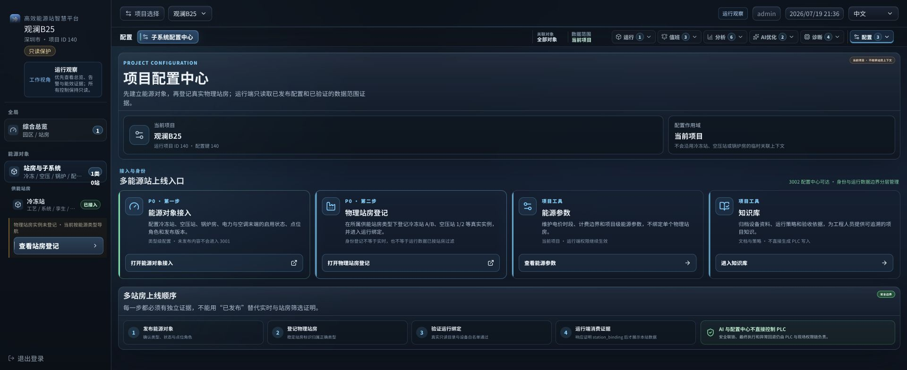
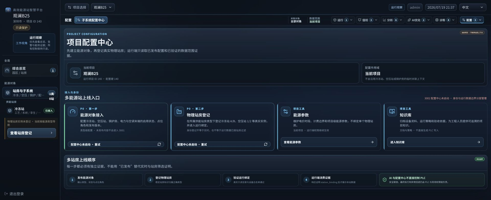
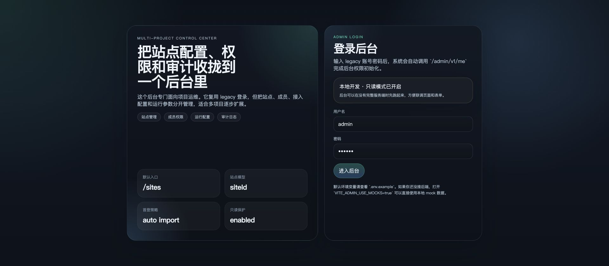
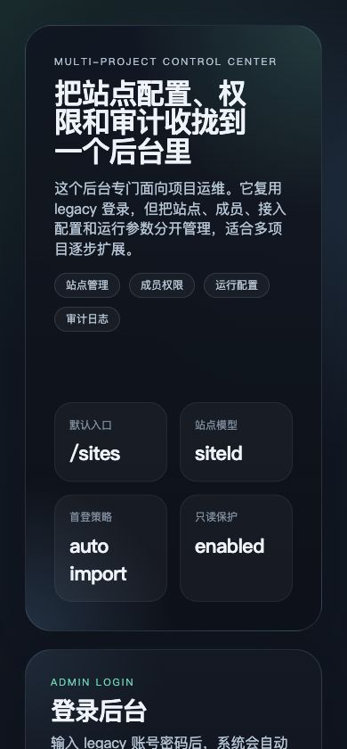
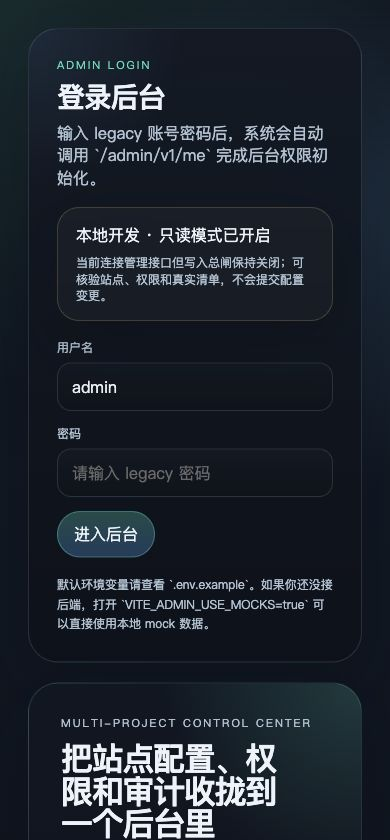
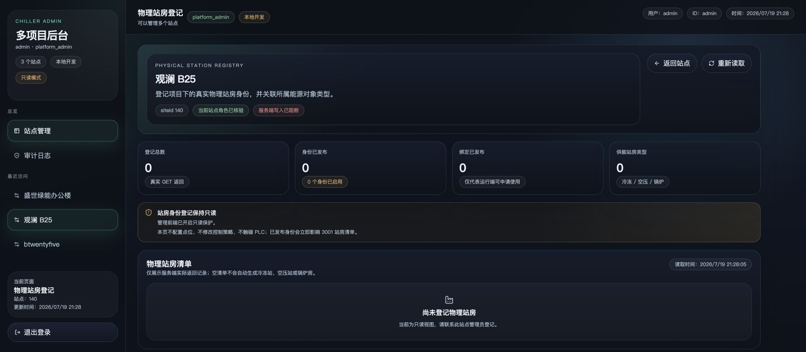
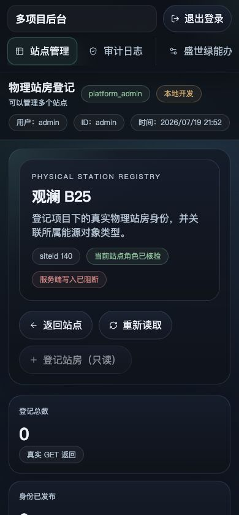
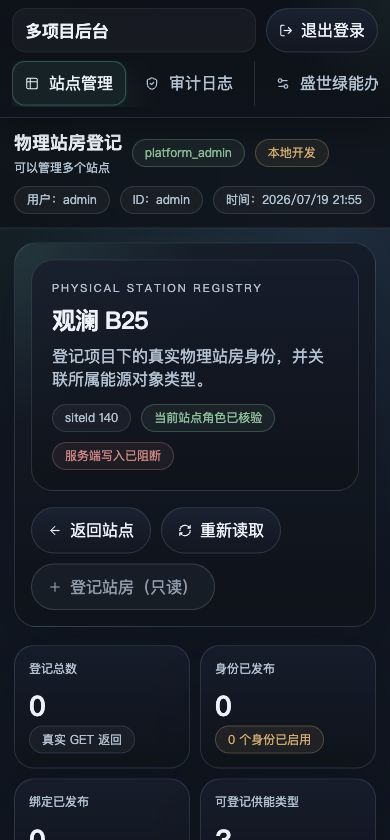
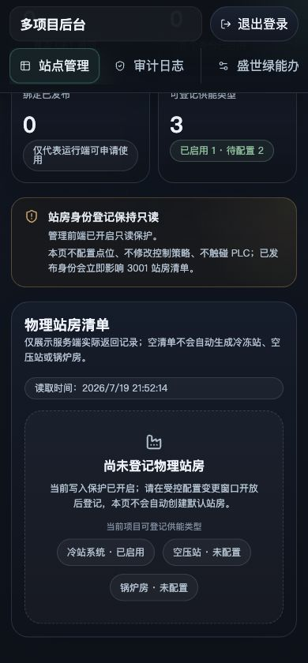

# 物理站房登记主流程 UI 审计

审计日期：2026-07-19

审计对象：项目 `siteId=140`，路径为“3001 综合总览 → 项目配置 → 3002 物理站房登记”

审计边界：真实 Chrome、真实项目读取、只读模式；未登记站房、未创建设备/点位、未生成 PLC 或运行绑定。

## 总体结论

主流程的信息架构合理：冷冻站、空压站、锅炉房等物理供能站房继续归左侧导航；配置属于项目级工具，站房登记入口放在内容区右上方的项目配置工作区更合适。问题不在入口位置，而在跨服务可达性和空状态的下一步表达。

本轮已修复六个关键问题：3002 未启动时不再保留死链接；只读模式仍显示但禁用“登记站房”；“0 个实例”与“3 种可登记供能类型”分开表达；登录页不再预填密码；移动端先显示登录任务；移动端站房摘要改为 2×2，减少到达空状态前的滚动。当前 3002 服务已停止，3001 会明确显示“3002 配置中心未启动”并提供重试，不伪装可用。

真实项目状态仍为：可登记供能类型 3，其中当前项目已启用 1、待配置 2；物理站房实例 0。该状态不能通过前端自动补齐。

## 流程步骤与健康度

| 步骤 | 页面与任务 | 健康度 | 结论 |
| --- | --- | --- | --- |
| 1 | 3001 项目配置入口 | 良好 | 配置入口保持项目级 `siteId=140`，不继承 `station`/`stationId`。 |
| 2 | 3002 可达性核验 | 良好（安全失败） | 1.5 秒有界探测；不可达时不渲染外链，改为明确状态和重试。 |
| 3 | 3002 登录与运行边界 | 良好（已修复） | 真实管理接口与写入保护分别说明；密码默认留空；移动端登录任务位于第一屏。 |
| 4 | 物理站房空状态 | 良好（已修复） | 同时说明实例为 0、可登记类型为 3，以及当前项目类型启用状态；移动摘要采用 2×2。 |
| 5 | 站房登记写入 | 未执行 | 当前为只读保护，且缺少经工程人员确认的站房身份与设备边界。 |

## 第 1 步：项目配置入口

健康度：良好。

3002 临时可达时，3001 能正确显示“3002 配置中心可达”，并提供当前项目的子系统配置和物理站房登记入口。

优点：

- 项目配置与站房运行工作区分开，避免把配置误认为当前站房专属功能。
- 链接带 `siteId=140`，不携带物理站房上下文。
- 两个入口按“能力配置”和“站房身份”拆分，职责清晰。

## 第 2 步：配置中心不可达状态

健康度：良好（安全失败）。

审计开始时 3002 没有监听，但 3001 原先仍展示可点击外链，这是主流程阻断。修复后，页面会先核验 3002；不可达时两张配置卡均变为“配置中心未启动 · 重试”，页面内不再存在 3002 外链。

验证结果：`data-admin-entry-state=unavailable`、3002 外链数量为 0、重试按钮数量为 2；点击重试后仍按真实可达性返回，不产生虚假成功。

## 第 3 步：登录与只读边界

健康度：良好（已修复）。

下面是修复前证据：登录页曾预填开发密码，并用较含糊的文案描述只读环境。预填密码会造成演示凭据泄露和误提交风险。

修复后：密码状态默认为空；页面分别说明“本地 mock”“真实管理接口 + 写入保护”“真实环境 + 权限/安全门禁”。

390px 移动视口还发现了桌面双栏折叠后的顺序问题：品牌说明先占满第一屏，密码和“进入后台”按钮需要向下滚动才能看到。

修复后只在移动断点将登录卡排到前面，品牌说明完整保留在后方。用户名、空密码输入和“进入后台”按钮均位于首屏，按钮底部位置为 558px。

## 第 4 步：物理站房登记空状态

健康度：良好（已修复）。

修复前页面有三处误导：只读模式完全隐藏主操作；“供能站房类型 0”把实例数和类型数混为一谈；空状态建议“联系管理员”，没有说明真实写入门禁。

修复后页面保留“登记站房（只读）”并禁用，明确写入保护；摘要改为“可登记供能类型 3”，同时显示“已启用 1 · 待配置 2”；空状态逐项列出冷冻站、空压站、锅炉房的当前项目状态。

移动端修复前四张摘要被强制单列，390px 页面总高度为 1802px，关键空状态需要额外滚动约两屏；禁用主操作的文字也偏暗。

修复后摘要采用 2×2，两列各 176px；页面总高度降至 1525px，减少 277px。页面仍保持 `scrollWidth=390`，没有横向溢出；只读主操作高度 47px、文字不透明度提高到 0.78。

这能让工程人员准确区分：

- “物理站房实例 0”是尚未登记真实身份。
- “可登记供能类型 3”是产品支持的物理供能站房类别。
- “已启用 1 · 待配置 2”是当前项目能力状态，不等于已有物理站房。
- 只读门禁关闭前不会创建默认站，也不会隐式创建设备、点位或控制关系。

## 发现与处置

| 优先级 | 发现 | 影响 | 处置 |
| --- | --- | --- | --- |
| P1 | 3002 未启动时仍显示可点击入口 | 用户进入死链，无法完成登记 | 已修复：有界可达性探测、不可达状态、重试按钮、移除死链接。 |
| P1 | 只读模式隐藏登记主操作 | 用户无法判断下一步及权限原因 | 已修复：操作始终可见；只读时禁用并解释写入门禁。 |
| P2 | “供能站房类型 0”混淆实例数和类型数 | 误判系统不支持冷站/空压站/锅炉房 | 已修复：全局供能类型与当前项目启用状态交叉展示。 |
| P2 | 登录页预填密码 | 凭据暴露与误提交风险 | 已修复：密码默认空值。 |
| P1 | 移动端品牌说明先于登录表单 | 运维人员首屏无法看到密码和进入按钮 | 已修复：860px 以下登录任务优先，品牌说明保留在后。 |
| P2 | 移动端四张摘要强制单列 | 关键“0 站房”结论被推迟约两屏 | 已修复：390px 采用 2×2；360px 以下回退单列。 |
| P2 | 3002 目前没有固化为持久服务 | 配置工作流只能在服务启动后执行 | 当前明确显示不可达；是否固化 3002 应作为独立运维决策。 |
| 阻断 | 项目 140 缺少真实站房身份数据 | 不能安全登记或建立运行绑定 | 需要现场确认 `stationName`、稳定 `stationId`、父供能类型和设备边界。 |

## 可访问性与视觉检查

- 不可达状态同时使用文字、图标和颜色，不依赖红色单独传达含义。
- 禁用按钮保留可见名称和原因；不会让只读用户误以为功能不存在。
- 1920px 桌面和 390px 移动 Chrome 视口均未出现横向溢出；移动 `scrollWidth` 与 `viewportWidth` 均为 390。
- 只读主操作实测高度 47px；导航和退出登录继续保持不少于 44px 的触控目标。
- 登录密码实测初始长度为 0；移动登录按钮在第一屏内完整可见。
- 本轮验证了视觉重排和主要操作可达性，但截图不能证明完整 WCAG 符合性；屏幕阅读器播报、系统字体放大和真实触屏手势仍需专项测试。

## 验证记录

- `apps/chiller-admin-v1`: `npm run check && npm run build` 通过。
- `apps/chiller-shell-v1`: `npm run check && npm run build` 通过。
- 真实 Chrome 验证了 3002 可达、物理站房只读空状态、3002 停止后的不可达状态和重试行为，并补充 390px 登录与站房登记前后对照。
- 临时 3002/8788 审计服务已停止；固定 3001 与既有 8787 保持运行。

## 下一步输入清单

在开放受控写入窗口前，每个物理站房至少需要工程人员确认：

1. `stationName`：现场使用且甲方认可的站房名称。
2. `stationId`：项目内稳定唯一、不会随名称修改而变化的标识。
3. `parentSubsystemType`：`chilled_plant`、`compressed_air` 或 `boiler_room`。
4. 设备边界：纳入该站房的冷机/水泵/冷却塔，或空压机/干燥机/储气罐，或锅炉及辅机清单。
5. 数据与控制边界：只读测点、可控目标、PLC 安全保护和审批责任人。

以上数据未确认前，系统继续保持 0 个物理站房比自动生成“默认站”更安全，也更符合后续验收和商业交付要求。
